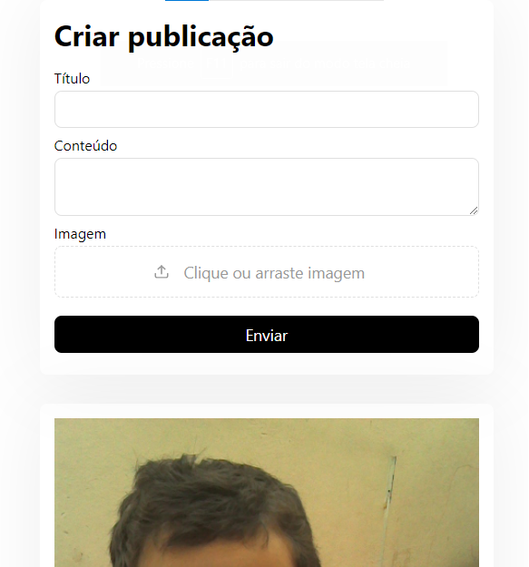

# Atividade de Framework

<div>
  
  
</div>

## Aplicação para criação de posts

- Usuário pode acessar a aplicação no Celular e Computador
- Usuário pode fazer uma publicação com imagem, título e conteúdo
- A imagem será armazenada na pasta `backend/uploads`
- Ao carregar a página o usuário verá todas as publicações

## Como iniciar

Faça clone do projeto, e abra o terminal na pasta raíz, e então siga os caminhos abaixo:

**Para o Backend:**

```bash
cd backend
```

Para instalar as dependências utilize:

```bash
yarn ou npm install
```

Para rodar a aplicação na porta 3001: 

```bash
yarn dev ou npm run dev
```

**Para o Frontend:**

```bash
cd frontend
```

Para instalar as dependências utilize:

```bash
yarn ou npm install
```

Para rodar a aplicação na porta 3000: 

```bash
yarn dev ou npm run dev
```


## Resultado da aplicação:


